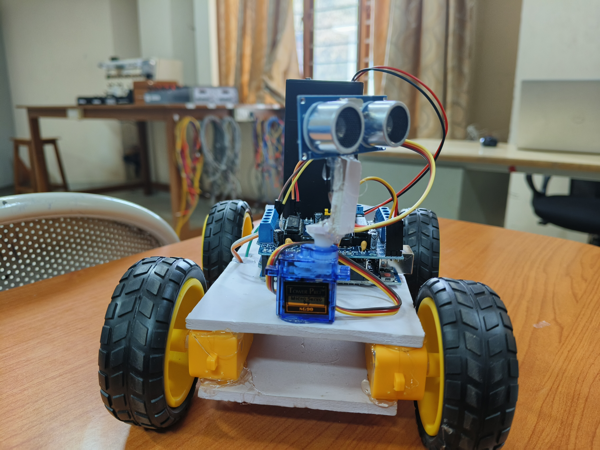
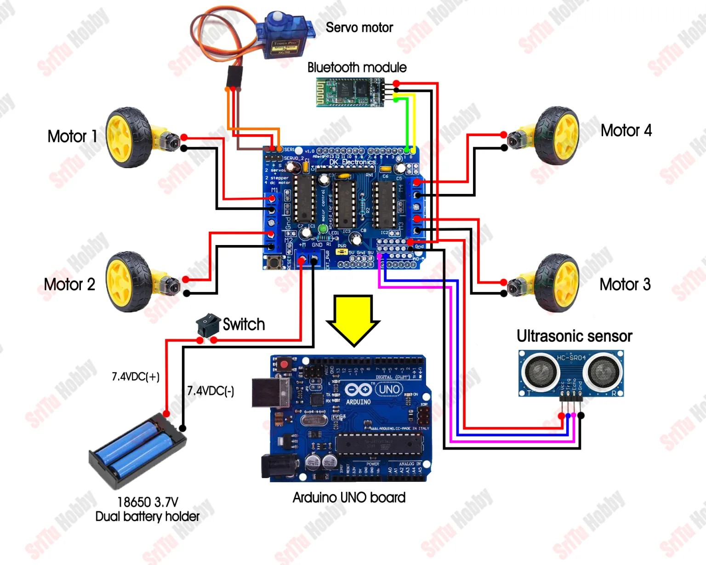
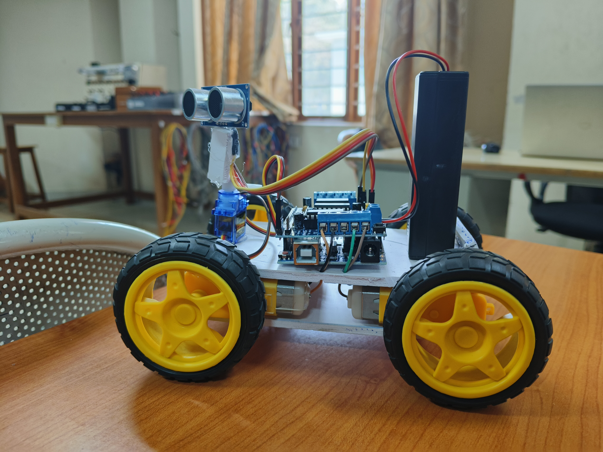

# Obstacle Avoidance Robot Car

## Project Introduction

This project focuses on developing an autonomous robot car that can detect and avoid obstacles without human intervention. The robot is built using an Arduino UNO, an HC-SR04 ultrasonic sensor, and a servo motor. By continuously monitoring its surroundings, the robot can make decisions and navigate around obstacles in real time.

The main objective of this project is to demonstrate the fundamentals of robotics, sensor integration, and autonomous movement using Arduino technology.

---

## Key Features

* Detects obstacles automatically
* Navigates without manual control
* Uses a servo motor to scan different directions
* Measures distance in real time with an ultrasonic sensor
* Chooses the safest path to continue movement
* Compact and cost-effective robotic design

---

## Hardware Requirements

* Arduino UNO
* L293D Motor Driver Shield
* HC-SR04 Ultrasonic Sensor
* Servo Motor
* DC Gear Motors (4)
* Robot Wheels (4)
* Li-ion Battery Pack
* Battery Holder
* Connecting Wires
* Foam Board or Similar Chassis Material

---

## System Operation

The robot begins by moving forward while constantly checking for obstacles using the ultrasonic sensor. When an object is detected within a specified distance, the robot immediately stops. The servo motor then rotates the sensor to inspect both the left and right sides.

After collecting distance measurements from both directions, the robot compares the values and selects the direction with more available space. It turns toward that side and continues moving forward. This process is repeated continuously, allowing the robot to travel autonomously while avoiding collisions.

---

## Knowledge Gained

Through this project, the following concepts were explored:

* Arduino-based embedded programming
* Distance measurement using ultrasonic sensors
* DC motor control techniques
* Servo motor positioning
* Autonomous robotic navigation
* Problem-solving and hardware integration

---

## Challenges and Limitations

* Relies on a basic obstacle avoidance strategy
* Unable to store or remember environmental information
* No intelligent route optimization
* Limited performance in crowded or dynamic environments

---

## Possible Enhancements

Future versions of the project can include:

* Line-following capability
* Bluetooth or Wi-Fi control options
* IoT integration for remote monitoring
* Camera-based object detection
* Advanced navigation algorithms
* Custom-designed 3D-printed chassis

## Project Images

### Obstacle avoiding bot

### Circuit Diagram

### Side View

## Conclusion

The Obstacle Avoidance Robot Car successfully demonstrates autonomous navigation using simple electronic components and Arduino programming. It serves as an excellent beginner-friendly robotics project and provides a strong foundation for developing more advanced autonomous systems in the future.

---

## Author

**Domin Alex**
